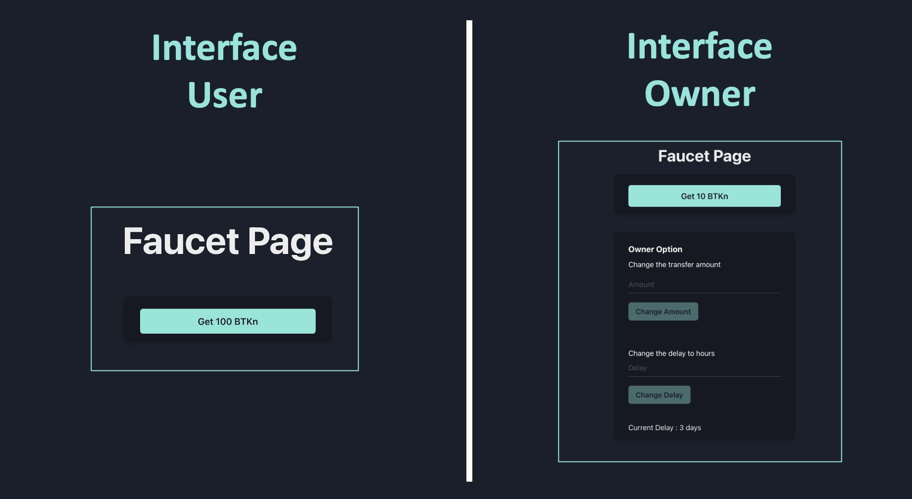

# BlueToken-Dapp_v1.0 - Faucet (BTKn)

# 


**NOTE:** 
- The BlueToken Faucet has been deployed on the Rinkeby testnet
- The owner has additional functionality: setDelay and setTokenAmount
- BlueToken Hardhat address GitHub : https://github.com/ricardo-eth/BlueToken-Hardhat_v1.0

# 

## Project Architecture :

```bash

public
├── img
│   └── All img..
├── favicon.ico
├── index.html
├── manifest.json
├── robots.txt
├── _redirects
│
│
src
├── App.js
├── components
│   ├── Countdown.js
│   ├── Header.js
│   ├── OwnerOptions.js
│   ├── index.js
│   ├── MetaMask
│   │   ├── MetaMaskBalanceOf.js
│   │   ├── MetaMaskInfo.js
│   │   ├── MetaMaskInstalled.js
│   │   └── MetaMaskTransfer.js
│   └── Navigation
│       ├── Navigation.js
│       └── NavigationLogged.js
├── contracts
│   ├── BlueToken.js
│   └── Faucet.js
├── Pages
│   ├── ERC20.js
│   ├── Faucet.j
│   ├── Home.js
│   └── index.js
└── index.js
```
## Features :

- Project set up using :

```js
    "dependencies": {
    "@chakra-ui/icons": "^1.0.13",
    "@chakra-ui/react": "^1.6.3",
    "@emotion/react": "^11",
    "@emotion/styled": "^11",
    "@testing-library/jest-dom": "^5.11.4",
    "@testing-library/react": "^11.1.0",
    "@testing-library/user-event": "^12.1.10",
    "@types/jest": "^26.0.23",
    "@types/node": "^15.12.2",
    "@types/react": "^17.0.11",
    "@types/react-dom": "^17.0.7",
    "ethers": "^5.3.0",
    "framer-motion": "^4",
    "react": "^17.0.2",
    "react-dom": "^17.0.2",
    "react-router-dom": "^5.2.0",
    "react-scripts": "4.0.3",
    "typescript": "^4.3.2",
    "web-vitals": "^1.0.1",
    "web3-hooks": "^1.0.3"
  },
```
### Install :

Clone Repo Git : https://github.com/ricardo-eth/BlueToken-Dapp_v1.0/tree/main

```zsh
% git clone git@github.com:ricardo-eth/BlueToken-Dapp_v1.0.git
% cd BlueToken-Dapp_v1.0
```
### Install dependencies :

```zsh
% yarn install
```
### Run the app in the devlopement mode :

```zsh
% yarn start
```
# 
## How to Add Your Custom BlueToken (BTKn) to MetaMask

1. Open MetaMask and click on the "burger" menu icon:
2. Click on the "ADD TOKEN" button:
3. Select "Custom Token" tab:
4. Paste the copied contract address from the first step to the "Token Address" (Verification : Address, Token Symbol and Decimal)
5. Click the "NEXT" button:
6. Click the "ADD TOKENS" button:
7. You are done.

## Deployed Faucet Token
- ### Address Contract : 
* Address : See below table
* Token : BKTn
* Decimal : 18

| Network  | Address |
| ------------- | ------------- |
| Rinkeby  | [0xA6dB68cfE4C4735d1a2158Bc4e2D6C663e038cD7](https://rinkeby.etherscan.io/token/0xA6dB68cfE4C4735d1a2158Bc4e2D6C663e038cD7)  |

<br />

# 
## Testnet Ether Faucets

Testnet   | Explorers                     | Testnet ETH Faucets
:-------- |:----------------------------- |:-------------------------
Rinkeby   | https://rinkeby.etherscan.io/ | https://faucet.rinkeby.io/ |

<br />
